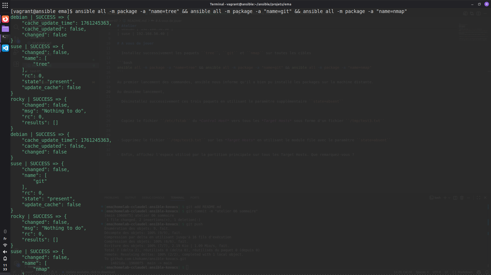
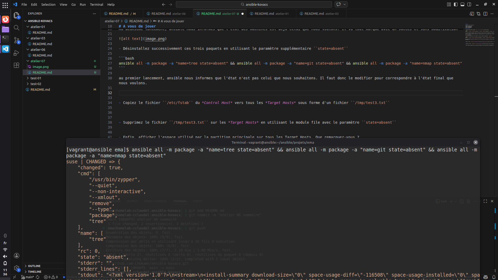
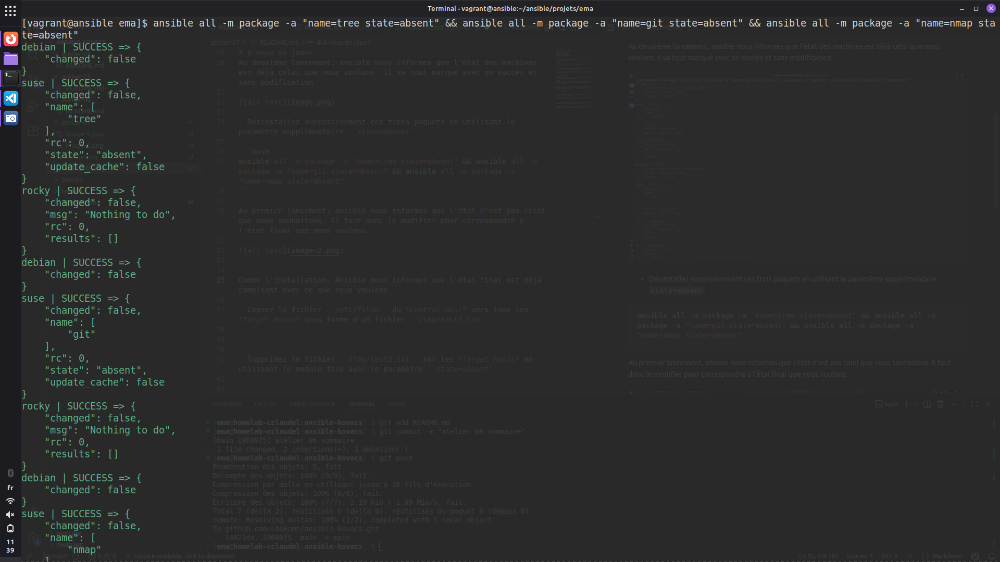
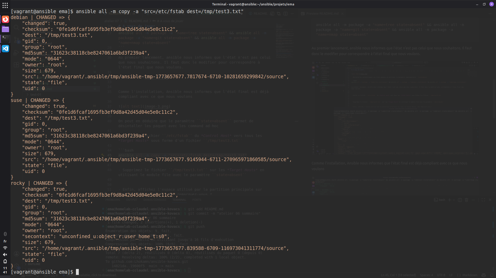
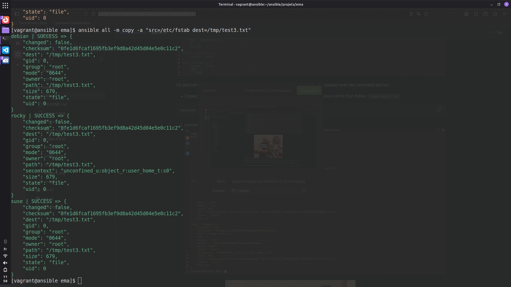
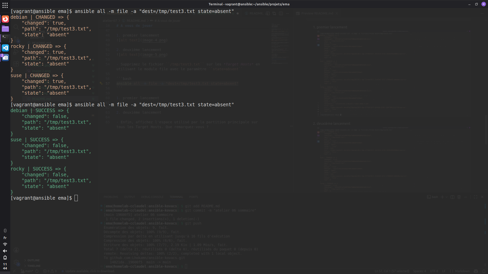
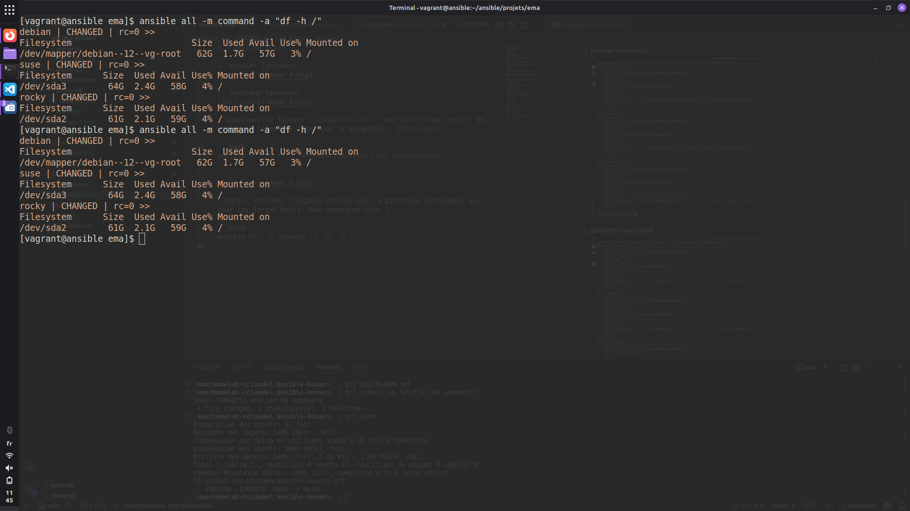

# A vous de jouer

# Atelier 07

| Machine virtuelle | Adresse IP |
| - | - |
| ansible | 192.168.56.10 |
| rocky | 192.168.56.20 |
| debian | 192.168.56.30 |
| suse | 192.168.56.40 |

# A vous de jouer

- Installez successivement les paquets ``tree``, ``git`` et ``nmap`` sur toutes les cibles

```bash
ansible all -m package -a "name=tree" && ansible all -m package -a "name=git" && ansible all -m package -a "name=nmap"
```

Au premier lancement des commandes, ansible nous informe qu'il a bien pu installé les packages sur la machine distante. 

Au deuxième lancement, ansible nous informes que l'état des machines est déjà celui que nous voulons. il va tout marqué avec un succès et sans modification



- Désinstallez successivement ces trois paquets en utilisant le paramètre supplémentaire ``state=absent``

```bash
ansible all -m package -a "name=tree state=absent" && ansible all -m package -a "name=git state=absent" && ansible all -m package -a "name=nmap state=absent"
```

Au premier lancement, ansible nous informes que l'état n'est pas celui que nous souhaitons. Il faut donc le modifier pour correspondre à l'état final que nous voulons. 




Comme l'installation, Ansible nous informes que l'état final est déjà compliant avec ce que nous voulons




On peut en déduire que le paramètre ``state=absent`` permet de désintaller les paquet avec les command ad-hoc

- Copiez le fichier ``/etc/fstab`` du *Control Host* vers tous les *Target Hosts* sous forme d'un fichier ``/tmp/test3.txt``

```bash
ansible all -m copy -a "src=/etc/fstab dest=/tmp/test3.txt"
```

1. premier lancement


2. deuxième lancement


L'idempotence est bien présent, un fichier s'il est le même ne vas pas changer. Ansible vérifie toujours l'état avant de faire une modification

- Supprimez le fichier ``/tmp/test3.txt`` sur les *Target Hosts* en utilisant le module file avec le paramètre ``state=absent``

```bash
ansible all -m file -a "dest=/tmp/test3.txt state=absent"
```




On remarque que l'idempotence est toujours bien présente. Le fichier a été supprimé au premier lancement et au deuxième lancement, il n'y a rien à supprimer donc l'état voulu est bon

- Enfin, affichez l'espace utilisé par la partition principale sur tous les Target Hosts. Que remarquez-vous ?

```bash
ansible all -m command -a "df -h /"
```




On remarque qu'il n'y a pas d'idempotence cette fois-ci. Cela est complétement logique car cela ne vérifie pas l'état des *Target Hosts*, mais leur demande uniquement de récupérer une information.

[Atelier suivant ->](../atelier-10/)
