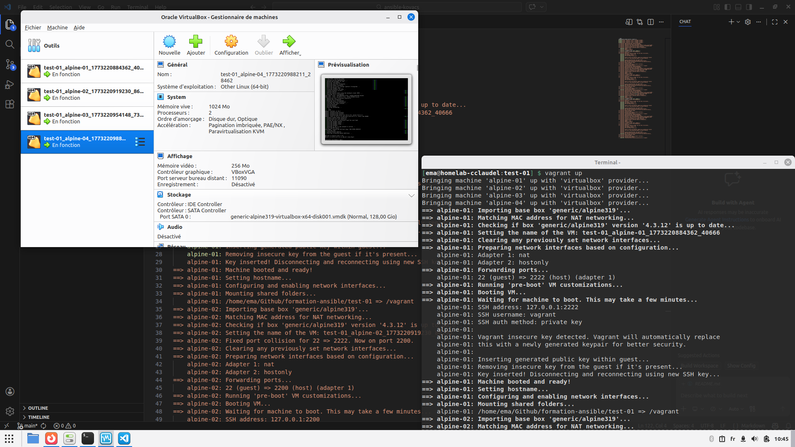

```bash
[ema@homelab-cclaudel:test-01] $ vagrant up
Bringing machine 'alpine-01' up with 'virtualbox' provider...
Bringing machine 'alpine-02' up with 'virtualbox' provider...
Bringing machine 'alpine-03' up with 'virtualbox' provider...
Bringing machine 'alpine-04' up with 'virtualbox' provider...
==> alpine-01: Importing base box 'generic/alpine319'...
==> alpine-01: Matching MAC address for NAT networking...
==> alpine-01: Checking if box 'generic/alpine319' version '4.3.12' is up to date...
==> alpine-01: Setting the name of the VM: test-01_alpine-01_1773220884362_40666
==> alpine-01: Clearing any previously set network interfaces...
==> alpine-01: Preparing network interfaces based on configuration...
    alpine-01: Adapter 1: nat
    alpine-01: Adapter 2: hostonly
==> alpine-01: Forwarding ports...
    alpine-01: 22 (guest) => 2222 (host) (adapter 1)
==> alpine-01: Running 'pre-boot' VM customizations...
==> alpine-01: Booting VM...
==> alpine-01: Waiting for machine to boot. This may take a few minutes...
    alpine-01: SSH address: 127.0.0.1:2222
    alpine-01: SSH username: vagrant
    alpine-01: SSH auth method: private key
    alpine-01: 
    alpine-01: Vagrant insecure key detected. Vagrant will automatically replace
    alpine-01: this with a newly generated keypair for better security.
    alpine-01: 
    alpine-01: Inserting generated public key within guest...
    alpine-01: Removing insecure key from the guest if it's present...
    alpine-01: Key inserted! Disconnecting and reconnecting using new SSH key...
==> alpine-01: Machine booted and ready!
==> alpine-01: Setting hostname...
==> alpine-01: Configuring and enabling network interfaces...
==> alpine-01: Mounting shared folders...
    alpine-01: /home/ema/Github/formation-ansible/test-01 => /vagrant
==> alpine-02: Importing base box 'generic/alpine319'...
==> alpine-02: Matching MAC address for NAT networking...
==> alpine-02: Checking if box 'generic/alpine319' version '4.3.12' is up to date...
==> alpine-02: Setting the name of the VM: test-01_alpine-02_1773220919230_86296
==> alpine-02: Fixed port collision for 22 => 2222. Now on port 2200.
==> alpine-02: Clearing any previously set network interfaces...
==> alpine-02: Preparing network interfaces based on configuration...
    alpine-02: Adapter 1: nat
    alpine-02: Adapter 2: hostonly
==> alpine-02: Forwarding ports...
    alpine-02: 22 (guest) => 2200 (host) (adapter 1)
==> alpine-02: Running 'pre-boot' VM customizations...
==> alpine-02: Booting VM...
==> alpine-02: Waiting for machine to boot. This may take a few minutes...
    alpine-02: SSH address: 127.0.0.1:2200
    alpine-02: SSH username: vagrant
    alpine-02: SSH auth method: private key
    alpine-02: 
    alpine-02: Vagrant insecure key detected. Vagrant will automatically replace
    alpine-02: this with a newly generated keypair for better security.
    alpine-02: 
    alpine-02: Inserting generated public key within guest...
    alpine-02: Removing insecure key from the guest if it's present...
    alpine-02: Key inserted! Disconnecting and reconnecting using new SSH key...
==> alpine-02: Machine booted and ready!
==> alpine-02: Setting hostname...
==> alpine-02: Configuring and enabling network interfaces...
==> alpine-02: Mounting shared folders...
    alpine-02: /home/ema/Github/formation-ansible/test-01 => /vagrant
==> alpine-03: Importing base box 'generic/alpine319'...
==> alpine-03: Matching MAC address for NAT networking...
==> alpine-03: Checking if box 'generic/alpine319' version '4.3.12' is up to date...
==> alpine-03: Setting the name of the VM: test-01_alpine-03_1773220954148_73358
==> alpine-03: Fixed port collision for 22 => 2222. Now on port 2201.
==> alpine-03: Clearing any previously set network interfaces...
==> alpine-03: Preparing network interfaces based on configuration...
    alpine-03: Adapter 1: nat
    alpine-03: Adapter 2: hostonly
==> alpine-03: Forwarding ports...
    alpine-03: 22 (guest) => 2201 (host) (adapter 1)
==> alpine-03: Running 'pre-boot' VM customizations...
==> alpine-03: Booting VM...
==> alpine-03: Waiting for machine to boot. This may take a few minutes...
    alpine-03: SSH address: 127.0.0.1:2201
    alpine-03: SSH username: vagrant
    alpine-03: SSH auth method: private key
    alpine-03: 
    alpine-03: Vagrant insecure key detected. Vagrant will automatically replace
    alpine-03: this with a newly generated keypair for better security.
    alpine-03: 
    alpine-03: Inserting generated public key within guest...
    alpine-03: Removing insecure key from the guest if it's present...
    alpine-03: Key inserted! Disconnecting and reconnecting using new SSH key...
==> alpine-03: Machine booted and ready!
==> alpine-03: Setting hostname...
==> alpine-03: Configuring and enabling network interfaces...
==> alpine-03: Mounting shared folders...
    alpine-03: /home/ema/Github/formation-ansible/test-01 => /vagrant
==> alpine-04: Importing base box 'generic/alpine319'...
==> alpine-04: Matching MAC address for NAT networking...
==> alpine-04: Checking if box 'generic/alpine319' version '4.3.12' is up to date...
==> alpine-04: Setting the name of the VM: test-01_alpine-04_1773220988211_28462
==> alpine-04: Fixed port collision for 22 => 2222. Now on port 2202.
==> alpine-04: Clearing any previously set network interfaces...
==> alpine-04: Preparing network interfaces based on configuration...
    alpine-04: Adapter 1: nat
    alpine-04: Adapter 2: hostonly
==> alpine-04: Forwarding ports...
    alpine-04: 22 (guest) => 2202 (host) (adapter 1)
==> alpine-04: Running 'pre-boot' VM customizations...
==> alpine-04: Booting VM...
==> alpine-04: Waiting for machine to boot. This may take a few minutes...
    alpine-04: SSH address: 127.0.0.1:2202
    alpine-04: SSH username: vagrant
    alpine-04: SSH auth method: private key
    alpine-04: 
    alpine-04: Vagrant insecure key detected. Vagrant will automatically replace
    alpine-04: this with a newly generated keypair for better security.
    alpine-04: 
    alpine-04: Inserting generated public key within guest...
    alpine-04: Removing insecure key from the guest if it's present...
    alpine-04: Key inserted! Disconnecting and reconnecting using new SSH key...
==> alpine-04: Machine booted and ready!
==> alpine-04: Setting hostname...
==> alpine-04: Configuring and enabling network interfaces...
==> alpine-04: Mounting shared folders...
    alpine-04: /home/ema/Github/formation-ansible/test-01 => /vagrant
```



[Atelier suivant ->](../test-02/)