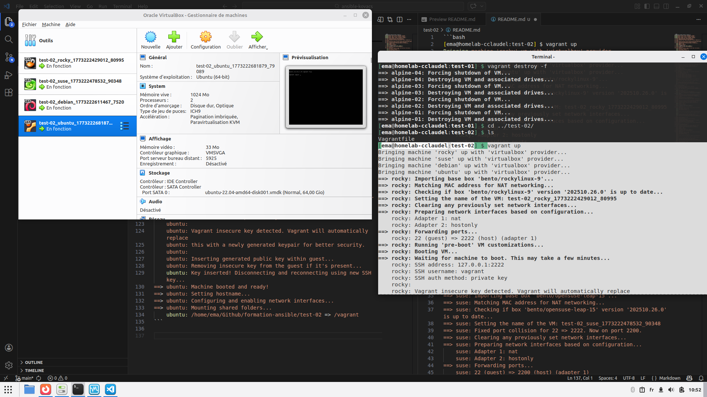

```bash
[ema@homelab-cclaudel:test-02] $ vagrant up
Bringing machine 'rocky' up with 'virtualbox' provider...
Bringing machine 'suse' up with 'virtualbox' provider...
Bringing machine 'debian' up with 'virtualbox' provider...
Bringing machine 'ubuntu' up with 'virtualbox' provider...
==> rocky: Importing base box 'bento/rockylinux-9'...
==> rocky: Matching MAC address for NAT networking...
==> rocky: Checking if box 'bento/rockylinux-9' version '202510.26.0' is up to date...
==> rocky: Setting the name of the VM: test-02_rocky_1773222429012_80995
==> rocky: Clearing any previously set network interfaces...
==> rocky: Preparing network interfaces based on configuration...
    rocky: Adapter 1: nat
    rocky: Adapter 2: hostonly
==> rocky: Forwarding ports...
    rocky: 22 (guest) => 2222 (host) (adapter 1)
==> rocky: Running 'pre-boot' VM customizations...
==> rocky: Booting VM...
==> rocky: Waiting for machine to boot. This may take a few minutes...
    rocky: SSH address: 127.0.0.1:2222
    rocky: SSH username: vagrant
    rocky: SSH auth method: private key
    rocky: 
    rocky: Vagrant insecure key detected. Vagrant will automatically replace
    rocky: this with a newly generated keypair for better security.
    rocky: 
    rocky: Inserting generated public key within guest...
    rocky: Removing insecure key from the guest if it's present...
    rocky: Key inserted! Disconnecting and reconnecting using new SSH key...
==> rocky: Machine booted and ready!
==> rocky: Setting hostname...
==> rocky: Configuring and enabling network interfaces...
==> rocky: Mounting shared folders...
    rocky: /home/ema/Github/formation-ansible/test-02 => /vagrant
==> suse: Importing base box 'bento/opensuse-leap-15'...
==> suse: Matching MAC address for NAT networking...
==> suse: Checking if box 'bento/opensuse-leap-15' version '202510.26.0' is up to date...
==> suse: Setting the name of the VM: test-02_suse_1773222478532_90348
==> suse: Fixed port collision for 22 => 2222. Now on port 2200.
==> suse: Clearing any previously set network interfaces...
==> suse: Preparing network interfaces based on configuration...
    suse: Adapter 1: nat
    suse: Adapter 2: hostonly
==> suse: Forwarding ports...
    suse: 22 (guest) => 2200 (host) (adapter 1)
==> suse: Running 'pre-boot' VM customizations...
==> suse: Booting VM...
==> suse: Waiting for machine to boot. This may take a few minutes...
    suse: SSH address: 127.0.0.1:2200
    suse: SSH username: vagrant
    suse: SSH auth method: private key
    suse: Warning: Connection reset. Retrying...
    suse: Warning: Remote connection disconnect. Retrying...
    suse: Warning: Connection reset. Retrying...
    suse: Warning: Remote connection disconnect. Retrying...
    suse: Warning: Connection reset. Retrying...
    suse: 
    suse: Vagrant insecure key detected. Vagrant will automatically replace
    suse: this with a newly generated keypair for better security.
    suse: 
    suse: Inserting generated public key within guest...
    suse: Removing insecure key from the guest if it's present...
    suse: Key inserted! Disconnecting and reconnecting using new SSH key...
==> suse: Machine booted and ready!
==> suse: Setting hostname...
==> suse: Configuring and enabling network interfaces...
==> suse: Mounting shared folders...
    suse: /home/ema/Github/formation-ansible/test-02 => /vagrant
==> debian: Box 'bento/debian-12' could not be found. Attempting to find and install...
    debian: Box Provider: virtualbox
    debian: Box Version: >= 0
==> debian: Loading metadata for box 'bento/debian-12'
    debian: URL: https://vagrantcloud.com/api/v2/vagrant/bento/debian-12
==> debian: Adding box 'bento/debian-12' (v202510.26.0) for provider: virtualbox (amd64)
    debian: Downloading: https://vagrantcloud.com/bento/boxes/debian-12/versions/202510.26.0/providers/virtualbox/amd64/vagrant.box
==> debian: Successfully added box 'bento/debian-12' (v202510.26.0) for 'virtualbox (amd64)'!
==> debian: Importing base box 'bento/debian-12'...
==> debian: Matching MAC address for NAT networking...
==> debian: Checking if box 'bento/debian-12' version '202510.26.0' is up to date...
==> debian: Setting the name of the VM: test-02_debian_1773222611467_7520
==> debian: Fixed port collision for 22 => 2222. Now on port 2201.
==> debian: Clearing any previously set network interfaces...
==> debian: Preparing network interfaces based on configuration...
    debian: Adapter 1: nat
    debian: Adapter 2: hostonly
==> debian: Forwarding ports...
    debian: 22 (guest) => 2201 (host) (adapter 1)
==> debian: Running 'pre-boot' VM customizations...
==> debian: Booting VM...
==> debian: Waiting for machine to boot. This may take a few minutes...
    debian: SSH address: 127.0.0.1:2201
    debian: SSH username: vagrant
    debian: SSH auth method: private key
    debian: 
    debian: Vagrant insecure key detected. Vagrant will automatically replace
    debian: this with a newly generated keypair for better security.
    debian: 
    debian: Inserting generated public key within guest...
    debian: Removing insecure key from the guest if it's present...
    debian: Key inserted! Disconnecting and reconnecting using new SSH key...
==> debian: Machine booted and ready!
==> debian: Setting hostname...
==> debian: Configuring and enabling network interfaces...
==> debian: Mounting shared folders...
    debian: /home/ema/Github/formation-ansible/test-02 => /vagrant
==> ubuntu: Importing base box 'bento/ubuntu-22.04'...
==> ubuntu: Matching MAC address for NAT networking...
==> ubuntu: Checking if box 'bento/ubuntu-22.04' version '202510.26.0' is up to date...
==> ubuntu: Setting the name of the VM: test-02_ubuntu_1773222681879_79089
==> ubuntu: Fixed port collision for 22 => 2222. Now on port 2202.
==> ubuntu: Clearing any previously set network interfaces...
==> ubuntu: Preparing network interfaces based on configuration...
    ubuntu: Adapter 1: nat
    ubuntu: Adapter 2: hostonly
==> ubuntu: Forwarding ports...
    ubuntu: 22 (guest) => 2202 (host) (adapter 1)
==> ubuntu: Running 'pre-boot' VM customizations...
==> ubuntu: Booting VM...
==> ubuntu: Waiting for machine to boot. This may take a few minutes...
    ubuntu: SSH address: 127.0.0.1:2202
    ubuntu: SSH username: vagrant
    ubuntu: SSH auth method: private key
    ubuntu: 
    ubuntu: Vagrant insecure key detected. Vagrant will automatically replace
    ubuntu: this with a newly generated keypair for better security.
    ubuntu: 
    ubuntu: Inserting generated public key within guest...
    ubuntu: Removing insecure key from the guest if it's present...
    ubuntu: Key inserted! Disconnecting and reconnecting using new SSH key...
==> ubuntu: Machine booted and ready!
==> ubuntu: Setting hostname...
==> ubuntu: Configuring and enabling network interfaces...
==> ubuntu: Mounting shared folders...
    ubuntu: /home/ema/Github/formation-ansible/test-02 => /vagrant
```



[Atelier suivant ->](../atelier-01/)